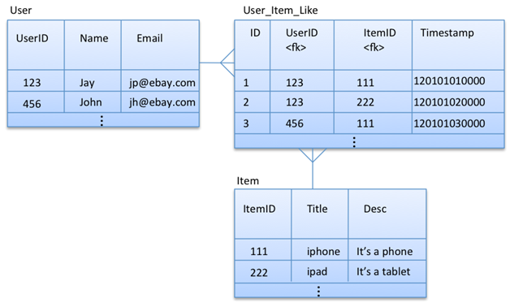

# cassandra-datamodelling-for-yammer-buddy
Saw a query on yammer regarding the conversion of Oracle SQL datamodel to Cassandra NoSQL datamodel.
And here is my approach.

----

Existing Oracle Model ::

----

### Queries That Cassandra Model Needs to Answer ::
<dl>
  <dd>1. Get the title and desc of all the items that a particular user likes</dd>
  
  <dd>2. Get the name and email of all the users who like a particular item</dd>
</dl>

----

### Cassandra Data Model In Action ::

