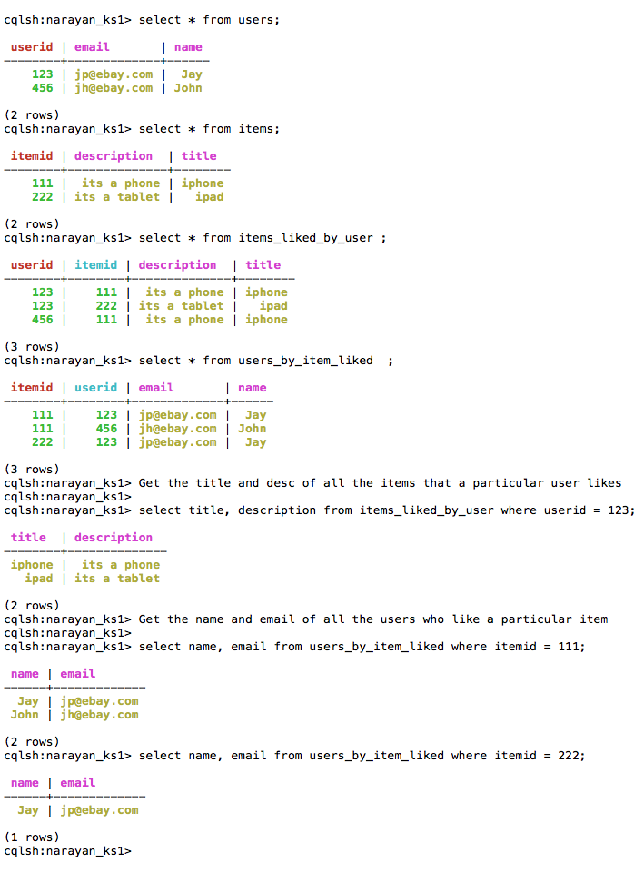

# cassandra-datamodelling-for-nandan
Saw a query on yammer regarding the conversion of Oracle SQL datamodel to Cassandra NoSQL datamodel.

Existing Oracle Model ::

### Queris That Cassandra Model Needs to Answer ::

..* Get the title and desc of all the items that a particular user likes

..* Get the name and email of all the users who like a particular item

